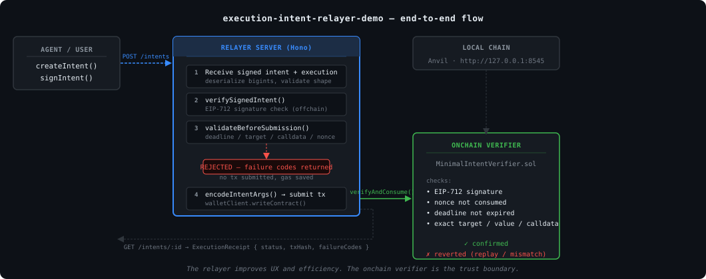

# execution-intent-relayer-demo

Minimal local relayer demo for [execution-intent-sdk](https://github.com/terriclaw/execution-intent-sdk).

Shows what a system does with a signed execution intent:
receive it, validate it, submit it, return a receipt.

---

## What this is

A tiny local HTTP relayer that:
- accepts signed execution intents via `POST /intents`
- validates offchain using `execution-intent-sdk`
- submits valid payloads to a local `MinimalIntentVerifier` contract on Anvil
- returns structured receipts with status and failure codes

## What this is not

- a production relayer
- a wallet
- a full delegation-framework integration
- persistent (in-memory only, lost on restart)
- authenticated or authorized
- gas-managed or retry-capable

---

## How it relates to execution-intent-sdk

This demo consumes `execution-intent-sdk` as a dependency.
All validation logic uses SDK helpers directly:
- `validateBeforeSubmission` — offchain preflight
- `verifySignedIntent` — signature check
- `encodeIntentArgs` — onchain args encoding
- `dataHash`, `defaultDomain` — intent utilities

The relayer is NOT the trust boundary.
The `MinimalIntentVerifier` contract is.

---

## How to run

### One command

    npm install
    cp .env.example .env
    # set RELAYER_PRIVATE_KEY in .env (Anvil account 0 for local testing)
    npm run demo:local

`demo:local` starts Anvil, starts the relayer server, runs all four demo cases, and cleans up automatically.

### Manual (for development / debugging)

    # Terminal 1
    anvil

    # Terminal 2
    npm run dev

    # Terminal 3
    npm run demo

---

## What the demo proves

Four cases:

1. **Valid exact execution inside grant** — scope checks pass, relayer submits, verifier confirms
2. **Mutated calldata** — relayer rejects offchain (EXECUTION_MISMATCH), no tx submitted
3. **Replay** — relayer submits, verifier reverts onchain (nonce already consumed), real tx hash returned
4. **Out-of-scope grant** — relayer rejects offchain (SCOPE_CHECK_FAILED), no tx submitted

Key distinction:
- The relayer catches mismatches and scope violations offchain (saves gas, improves UX)
- The onchain verifier is the final enforcement boundary (catches replay, validates signature, enforces exact match)
- Grant scope checks are offchain demo metadata — not enforced onchain

---

## What it does not prove

- Production gas management
- Distributed nonce coordination
- Retry or delivery guarantees
- Authentication
- Multi-chain or multi-enforcer support
- Real wallet UX

---

## Execution receipts

The relayer stores an `ExecutionReceipt` for every submitted intent.

    Delegation grants authority. Execution intent binds the exact action.
    Execution receipt records what happened.

A receipt answers:
- who signed the intent?
- what exact action was attempted?
- did offchain validation pass?
- was a transaction submitted?
- did the onchain verifier confirm or revert?
- what failure codes explain rejection?

Receipts cover the full pipeline: grant envelope → scope checks → signed intent → relayer validation → onchain verifier result.

When a `GrantEnvelope` is supplied, the receipt also includes `scopeChecks` and `scopeValid` showing whether the action stayed inside the declared authority envelope.

---

## Example receipts

### Confirmed

    {
      "id": "f0fac7ad-ce88-46cc-b8af-cce3065bd78d",
      "status": "confirmed",
      "offchainValid": true,
      "signer": "0xf39Fd6e51aad88F6F4ce6aB8827279cffFb92266",
      "account": "0xf39Fd6e51aad88F6F4ce6aB8827279cffFb92266",
      "target": "0x0000000000000000000000000000000000000001",
      "value": "0",
      "dataHash": "0xae075f11a95f563eb755a9a26431d11be6b969319478218a289666083ae538b3",
      "nonce": "1",
      "deadline": "1776295484",
      "txHash": "0x200c79b9526eec171da491d349f0d823d0900b4f8247bcfd31688c72079eae86",
      "blockNumber": "2"
    }

### Rejected offchain (calldata mismatch)

    {
      "id": "a139586e-1266-4b7d-808d-9b6f89863625",
      "status": "rejected",
      "offchainValid": false,
      "signer": "0xf39Fd6e51aad88F6F4ce6aB8827279cffFb92266",
      "account": "0xf39Fd6e51aad88F6F4ce6aB8827279cffFb92266",
      "target": "0x0000000000000000000000000000000000000001",
      "value": "0",
      "dataHash": "0xae075f11a95f563eb755a9a26431d11be6b969319478218a289666083ae538b3",
      "nonce": "2",
      "deadline": "1776295484",
      "failureCodes": ["EXECUTION_MISMATCH"],
      "failureReasons": ["execution does not match signed intent (target, value, or calldata mismatch)"]
    }

### Reverted onchain (replay — nonce already consumed)

Reverted receipts include a real tx hash because the transaction was submitted and mined, but the verifier reverted during execution.

    {
      "id": "551dbf40-955f-4add-a64f-efe72a0e905c",
      "status": "reverted",
      "offchainValid": true,
      "signer": "0xf39Fd6e51aad88F6F4ce6aB8827279cffFb92266",
      "account": "0xf39Fd6e51aad88F6F4ce6aB8827279cffFb92266",
      "target": "0x0000000000000000000000000000000000000001",
      "value": "0",
      "dataHash": "0xae075f11a95f563eb755a9a26431d11be6b969319478218a289666083ae538b3",
      "nonce": "1",
      "deadline": "1776295484",
      "txHash": "0xc2bbe9856dad19acd20e222701d00ec4f4d8a4aad907ccc6f23a71d0e944f926",
      "blockNumber": "3"
    }

## Demo cases

Four cases are proven end-to-end:

**Case 1: Valid exact execution inside grant** → `confirmed`
Signed intent matches execution exactly. All scope checks pass. Onchain verifier confirms.

**Case 2: Mutated calldata** → `rejected` (offchain)
Relayer detects calldata mismatch before submission. `EXECUTION_MISMATCH`. No tx submitted.

**Case 3: Replay attack** → `reverted` (onchain)
Passes offchain validation. Onchain verifier rejects — nonce already consumed. Real tx hash returned.

**Case 4: Out-of-scope grant** → `rejected` (offchain)
Target not in `allowedTargets`. `SCOPE_CHECK_FAILED`. No tx submitted.

Receipt status semantics:
- `rejected` — no transaction was ever submitted
- `confirmed` — transaction submitted and accepted by verifier
- `reverted` — transaction submitted, mined, verifier rejected onchain

---

## Grant envelopes and scope checks

A `GrantEnvelope` is optional structured metadata that models the early permission envelope. When supplied, the relayer runs scope checks before submission to verify the proposed execution stays inside the declared grant.

    Delegation grants authority. Execution intent binds the exact action.
    Execution receipt records what happened. Scope checks connect the late
    action back to the early grant envelope.

**Important:** Grant scope checks in this demo are offchain/demo-only metadata. They are not a substitute for onchain delegation verification. Future work is replacing this with real ERC-7710 / delegation-framework grant verification.

### Example request with grant

    {
      "signed": { ... },
      "execution": { "target": "0x001", "value": "0", "data": "0xa9059cbb..." },
      "grant": {
        "id":             "grant-001",
        "delegator":      "0x1111...",
        "delegate":       "0xf39F...",
        "allowedTargets": ["0x0000000000000000000000000000000000000001"],
        "maxValue":       "1000000000000000000",
        "expiry":         "1778920575"
      }
    }

### Example receipt with scope checks

    {
      "status":      "confirmed",
      "offchainValid": true,
      "scopeValid":  true,
      "scopeChecks": [
        { "code": "SIGNER_IS_DELEGATE",   "pass": true },
        { "code": "TARGET_ALLOWED",        "pass": true },
        { "code": "VALUE_WITHIN_LIMIT",    "pass": true },
        { "code": "GRANT_NOT_EXPIRED",     "pass": true },
        { "code": "DEADLINE_WITHIN_GRANT", "pass": true }
      ]
    }

### Out-of-scope rejection

If any scope check fails the relayer rejects offchain with `SCOPE_CHECK_FAILED`. No transaction is submitted.

    {
      "status":      "rejected",
      "offchainValid": false,
      "scopeValid":  false,
      "failureCodes": ["SCOPE_CHECK_FAILED"],
      "scopeChecks": [
        { "code": "TARGET_ALLOWED", "pass": false, "detail": "target 0x002 not in allowedTargets" }
      ]
    }

---

## Delegation signature verification

When a `delegation` object is supplied in the request, the relayer:

1. Computes the delegation hash using the same rules as `EncoderLib._getDelegationHash()`
2. Computes the domain hash matching `DelegationManager.getDomainHash()`
3. Computes the EIP-712 digest: `keccak256(0x1901 || domainHash || delegationHash)`
4. Recovers the signer from `delegation.signature`
5. Compares recovered signer to `delegation.delegator`

If verification fails, the request is rejected offchain with `DELEGATION_SIGNATURE_INVALID`. No transaction is submitted.

Example receipt with verified delegation:

    {
      "authoritySource":             "delegation-framework",
      "delegationHash":              "0x2ff3f3f7...",
      "delegationSignatureVerified": true,
      "delegationSigner":            "0xf39Fd6..."
    }

**Scope:**
- EOA delegators only — ERC-1271 smart-account delegators are not yet supported
- Signature verification only — caveats are not parsed or enforced
- No DelegationManager redemption path yet
- The domain verifying contract must match what was used when the delegation was signed

---

## Receipt attestation

Every terminal receipt is signed by the relayer after reaching its final state.

- `resultDigest` — keccak256 hash binding intentHash + authorityHash + status + verifierId + txHash
- `receiptSigner` — relayer account address
- `receiptSignature` — EIP-191 signature over `resultDigest`

Anyone can verify the receipt signature against `receiptSigner` to confirm the relayer attested to the observed result.

    {
      "status":           "confirmed",
      "resultDigest":     "0xb8cc62...",
      "receiptSigner":    "0xf39Fd6...",
      "receiptSignature": "0x..."
    }

**Important:** The receipt signature attests to what the relayer observed and returned. It does not prove the supplied `GrantEnvelope` was a real verified delegation. Authority verification remains offchain demo metadata.

---

## Authority receipt model

| Layer | Demo object | Purpose |
|---|---|---|
| Early authority | `GrantEnvelope` | Declares delegate, allowed targets, value cap, expiry |
| Late action | `SignedIntent` | Binds exact target / value / calldata hash / nonce / deadline |
| Scope bridge | `ScopeCheck[]` | Checks late action against grant envelope |
| Enforcement | `MinimalIntentVerifier` | Enforces signature, nonce, deadline, exact execution onchain |
| Audit output | `ExecutionReceipt` | Records authority context, validation, submission, result |

In this demo, `GrantEnvelope` is structured metadata supplied to the relayer — not a cryptographically verified delegation. Future work is replacing it with a real delegation-framework / ERC-7710-style authority object.

---

## API

### POST /intents
Submit a signed intent for validation and execution.

Request body:
    {
      "signed": {
        "intent": { "account", "target", "value", "data", "nonce", "deadline" },
        "signer": "0x...",
        "signature": "0x..."
      },
      "execution": { "target", "value", "data" }
    }

Note: value, nonce, deadline are strings (bigint serialization).

Response: ExecutionReceipt

### GET /intents/:id
Get receipt by ID.

### GET /intents
List all receipts.

### GET /verifier
Get deployed verifier address and chainId.

---

## Receipt shape

    {
      "id":             "uuid",
      "status":         "confirmed" | "rejected" | "submitted" | "reverted" | "received",
      "signer":         "0x...",
      "account":        "0x...",
      "target":         "0x...",
      "value":          "0",
      "dataHash":       "0x...",
      "nonce":          "1",
      "deadline":       "1234567890",
      "offchainValid":  true,
      "failureCodes":   ["EXECUTION_MISMATCH"],
      "failureReasons": ["execution does not match signed intent"],
      "grant":          { ... },
      "scopeChecks":    [ { "code": "TARGET_ALLOWED", "pass": true } ],
      "scopeValid":     true,
      "txHash":         "0x...",
      "blockNumber":    "5"
    }

Failure codes: INVALID_SIGNATURE, DEADLINE_EXPIRED, EXECUTION_MISMATCH, NONCE_REUSE_RISK, SCOPE_CHECK_FAILED

---

## Related

- SDK: https://github.com/terriclaw/execution-intent-sdk
- Reference enforcer: https://github.com/terriclaw/execution-bound-intent
- Design research: https://github.com/terriclaw/execution-bound-intent-global-replay
